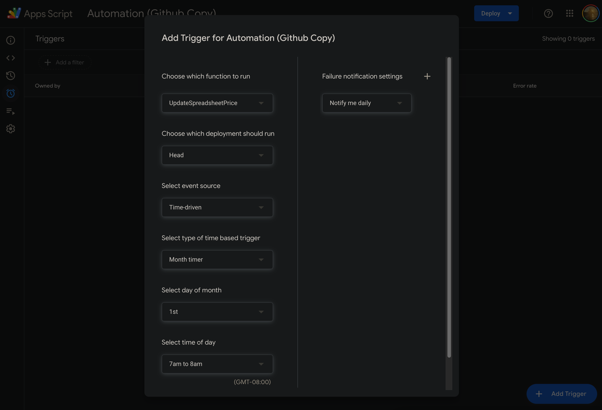

# PayTracker

A set of Google Scripts used to track subscription payments from Family Members only. Inspired by the [MailMerge Template](https://developers.google.com/apps-script/samples/automations/mail-merge) by Google.
- Tracks incoming e-transfers (or equivalent) from family members and logs it onto a Google Sheet.
- Updates all family members in the event of a subscription price change.

# Usage

Copy the Google Sheet [here](https://docs.google.com/spreadsheets/d/1uP-Mxf1mJG5-xn9GnUDpdnzJw3c-dV0DC4FAkwdxcgk/edit?gid=0#gid=0). To get the automation working:

1. Open the Apps Script menu at the top under Extensions.
   
   

2. Open the editor. In ```UpdatePriceMonthly.gs```, you'll need to update the email subject to a draft you have in your Gmail. 

    ```javascript
    // Line 38
    if (cell.getValue() > sheet.getRange(8, current-1).getValue()) {
      // UPDATE THIS: CHANGE THE EMAIL SUBJECT LINE
      var template = grabTemplate("<Subject Line>", sheet.getRange(8, current-1).getValue(), cell.getValue(), sheet.getRange(10, current).getValue().toFixed(2))
      sendEmail(template.subject, template.message);
    }
    ```
    This will be the email sent to all family members when a subscription price change occurs. You can draft the email anyway you   like, but keep in mind variables in the format ```{{ORIGINALPRICE}}```, ```{{NEWPRICE}}```, and ```{{PERPERSON}}``` will be      replaced accordingly.

3. Set up the automations. You'll need to setup 3 triggers for the price updates to work.

    

   - ```CheckPayments``` will scrape your inbox for incoming payments. Set this function to run at least every 2 hours.
   - ```UpdateSpreadsheetPrice``` will check for price updates for the current month. Set this function to run every month.
   - ```UpdatedPriceAlert``` checks if the price has increased this month, and sends an email to all family members if it has. set this function to run every month, and ensure it runs on a day **after** ```UpdateSpreadsheetPrice```
